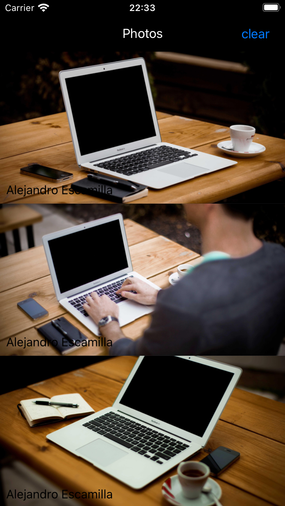

# PhotosApp

A simple iOS app that displays a collection of photos from Picsum Photos API using Clean Swift architecture.

## Features

- Display photos in a scrollable list
- Show author information for each photo
- Automatic image loading and caching
- Pull to refresh functionality

## Requirements

- iOS 13.0+
- Xcode 13.0+
- CocoaPods

## Installation

1. Clone the repository

```bash
git clone https://github.com/thingnoy/PhotoApp.git
cd PhotosApp
```

2. Install dependencies via CocoaPods

```bash
pod install
```

3. Open the workspace

```bash
open PhotosApp.xcworkspace
```

## Dependencies

- [Alamofire](https://github.com/Alamofire/Alamofire) - Networking
- [Kingfisher](https://github.com/onevcat/Kingfisher) - Image loading and caching
- [Wormholy](https://github.com/pmusolino/Wormholy) - Network debugging (Debug builds only)

## Project Structure

```
PhotosApp/
├── Application/
│   ├── AppDelegate.swift
│   └── SceneDelegate.swift
├── Common/
│   └── Models/
│       └── Photo.swift
└── Scenes/
    └── PhotosList/
        ├── PhotoListViewController.swift
        └── Cells/
            └── PhotoCell.swift
```

## API

The app uses the [Picsum Photos API](https://picsum.photos) to fetch random photos.

- Endpoint: `https://picsum.photos/v2/list`

## Screenshots


## License

This project is licensed under the MIT License - see the LICENSE file for details.
